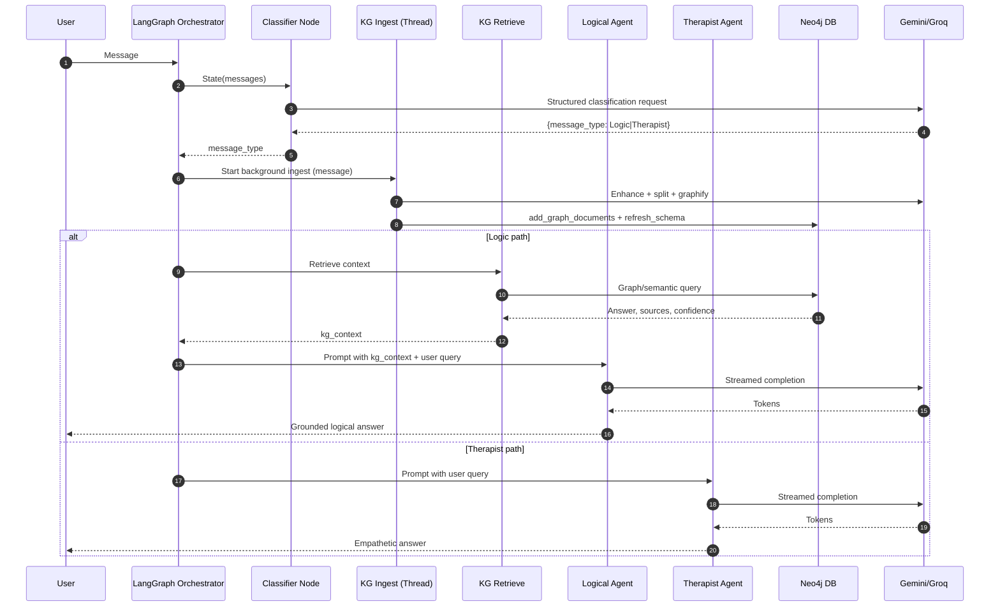
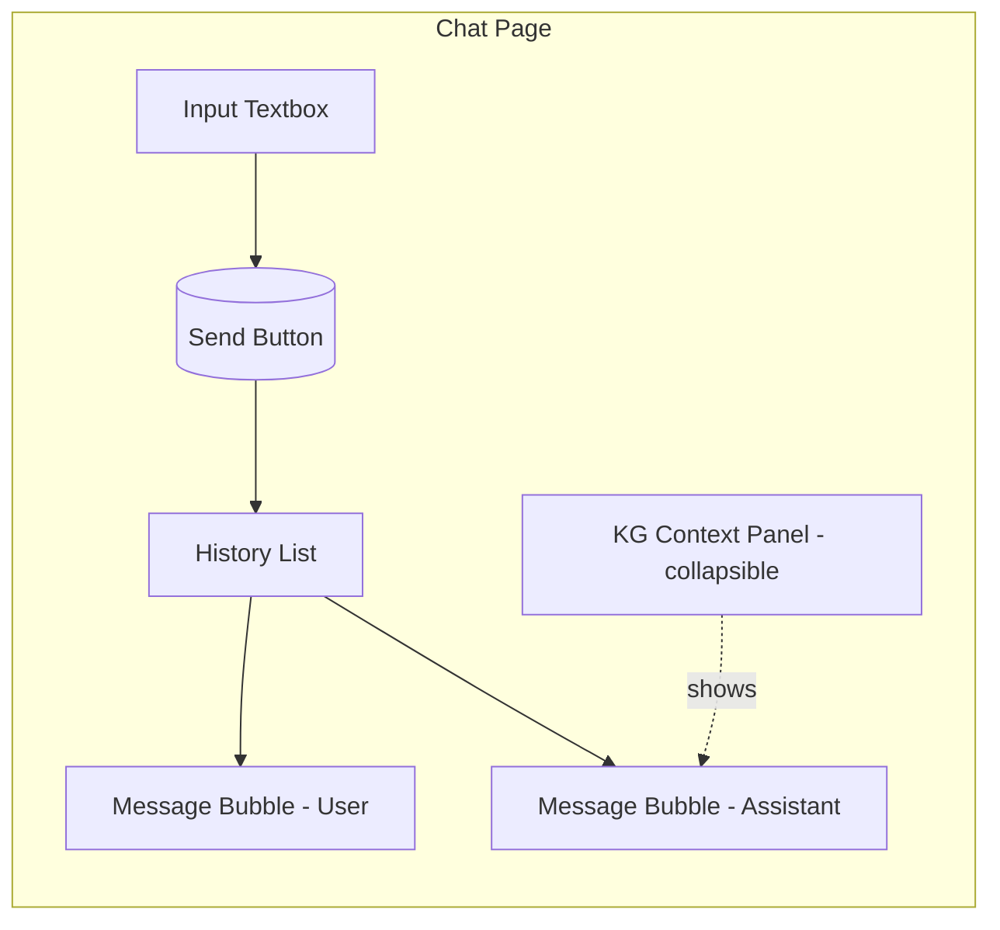
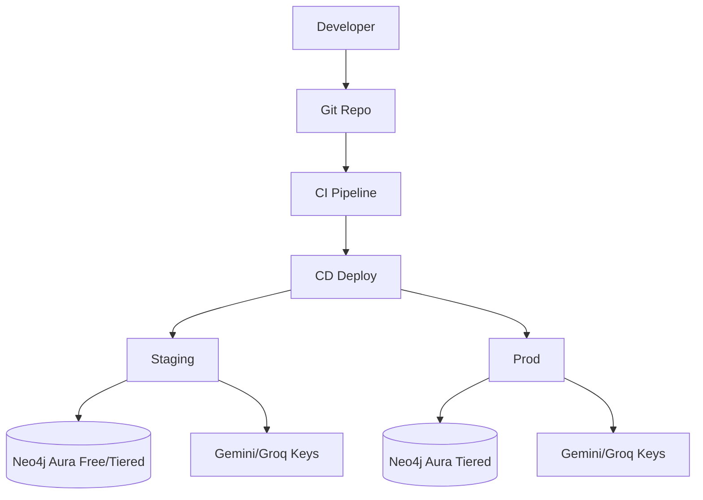

# Gen-AI-Exc: Emotion-Aware Assistant with Live Knowledge Graph

An AI assistant that blends empathetic support with logical, grounded answers using a live-updating Knowledge Graph (Neo4j) and a multi-agent state machine built with LangGraph. Messages are classified as emotional vs logical, ingested asynchronously into the graph, and logical queries are grounded with KG retrieval for factual accuracy.

## Why this can win a hackathon
- Emotion + Logic: Routes each turn to a Therapist agent (empathy) or Logical agent (reasoning) based on message classification.
- Live KG grounding: Every user message is asynchronously enriched and added to Neo4j, enabling retrieval-augmented responses in real-time.
- Practical integrations: Works with Gemini for generation, Groq for extraction, and Neo4j for graph reasoning; extendable to Notion, MCP tools, and more.
- Production-minded: Non-blocking KG ingestion, schema refresh, credential isolation, and clear extensibility.

---

## Demo Flow (CLI)
1) App starts the LangGraph.
2) You enter a message.
3) Message is classified.
4) The content is ingested into the KG in the background.
5) If classified as Logic, the system retrieves context from the KG and grounds the answer; else the Therapist agent replies with empathy.

```bash
cd backend
python main.py
# enter: "How do I plan my study schedule for exams?"
```

---

## Architecture

### High-level components
- Classifier Node: Decides Logic vs Therapist.
- KG Ingest Node: Asynchronously enriches and adds user content to Neo4j.
- KG Retrieve Node: Queries KG to produce compact, high-signal context.
- Logical Agent: Structured, grounded reasoning with KG context.
- Therapist Agent: Warm, supportive responses for emotional content.

### LangGraph state machine
```mermaid
flowchart TD
    START([START]) --> C[Classify Message]
    C --> I[KG Ingest (async)]
    I -->|Logic| R[KG Retrieve]
    I -->|Therapist| T[Therapist Agent]
    R --> L[Logical Agent]
    L --> END([END])
    T --> END([END])
```

### Data flow and modules
- `backend/graph/agent.py`: Builds the state machine and routes edges.
- `backend/graph/nodes/classify_message.py`: Uses LLM structured output to return `Logic` or `Therapist`.
- `backend/graph/nodes/kg_ingest.py`: Enhances, chunks, converts to graph documents, `add_graph_documents`, then `refresh_schema` (in a background thread).
- `backend/graph/nodes/kg_retrieve.py`: Queries KG, builds compact `kg_context` with confidence and top sources.
- `backend/graph/nodes/logical_agent.py`: Streams grounded logical response.
- `backend/graph/nodes/therapist_agent.py`: Streams empathetic response.

### Knowledge Graph internals
- Builder: `backend/KG/kg_builder.py` (class `RobustKnowledgeGraphBuilder`) handles enhancement, splitting, graph doc creation, and writes to Neo4j.
- Query: `backend/KG/kg_query.py` (class `RobustKnowledgeGraphQuery`) handles semantic/graph retrieval and confidence scoring.
- Credentials: `get_credentials_from_env()` gathers `groq_api_key`, `neo4j_uri`, `neo4j_username`, `neo4j_password`.

### Detailed architecture diagram


---

## Tech Stack
- Runtime: Python 3.13
- Orchestration: LangGraph (`langgraph`), LangChain core
- LLMs: Google Gemini (`langchain-google-genai`), Groq (for extraction in KG builder/query)
- Graph DB: Neo4j 5.x (`neo4j`, `langchain-neo4j`)
- Document processing: `unstructured`, `PyPDF2`, `python-docx`
- Utilities: `python-dotenv`, `typing-extensions`, `grandalf`
- Optional Integrations: MCP (`mcp`), Notion (`notion-client`)

Environment configuration via `backend/config/settings.py` (Pydantic BaseSettings, `.env`).

---

## Setup & Run

### 1) Prerequisites
- Python 3.11+ (tested with the provided venv using Python 3.13)
- Neo4j instance (local or Aura) and credentials
- API keys: Google Gemini, Groq

### 2) Environment variables (.env at `backend/.env` or repo root)
- `GOOGLE_API_KEY`
- `groq_api_key`
- `neo4j_uri` (e.g., bolt+s://<host>:7687)
- `neo4j_username`
- `neo4j_password`
- `neo4j_database` (optional)
- `notion_api_key` (optional)

Note: `settings.py` also defines `aura_instanceid`, `aura_instancename`, and logging fields if needed.

### 3) Install dependencies
```bash
cd backend
python -m venv venv
# Windows PowerShell
venv\Scripts\Activate.ps1
pip install -r requirements.txt
```

### 4) Start the CLI demo
```bash
cd backend
python main.py | cat
```

---

## Wireframes and Mock Diagrams
While the current demo is CLI-based, here are suggested wireframes for quick UI expansion.

### Chat UI (Web) – Wireframe


### Developer Ops – Mock Diagram


---

## Security & Privacy
- Do not log raw user content beyond necessity; redact secrets.
- Store credentials in environment variables; never commit them.
- For wellness use-cases, include guardrails around crisis language and escalation guidance.

---

## Extensibility Roadmap
- Web UI with session memory and togglable KG context pane.
- Notion sync via MCP tools for journaling and tasks.
- Speech I/O with STT/TTS for accessibility.
- Fine-grained Neo4j schema and domain ontologies per use-case.

---

## Cost Estimates (Monthly)
Assumptions for a light hackathon-scale deployment, ~5K messages/month, average 500 tokens each.

- LLM Inference (Gemini 2.5 Flash or similar):
  - ~2.5M output tokens + 2.5M input tokens
  - Estimated: $15–$60 depending on provider/pricing tier
- KG Extraction (Groq or similar for builder/query steps):
  - Batch extraction on 5K msgs, short prompts
  - Estimated: $5–$25
- Neo4j AuraDB:
  - Free or entry-tier: $0–$65
- Hosting (single small VM or serverless):
  - $5–$20
- Misc (logs, monitoring, storage):
  - $0–$10

Total (range): ~$25–$180/month for hackathon-scale usage.

Notes:
- Costs vary by region, provider, and tokenization behavior.
- You can reduce cost by disabling KG ingestion for short/low-value messages.

---

## How to Pitch in 90 Seconds
- Problem: AI helpers oscillate between empathy and logic; most lack persistent, structured memory.
- Solution: Emotion-aware routing + live graph memory that improves grounding every turn.
- Demo: Show a message classified, ingested, retrieved, and a grounded logical answer vs an empathetic one.
- Proof: Real Neo4j writes, retrieval confidence, sources list, and streamed responses.
- Impact: Better clarity, trust, and user retention. Extensible to support planning tools and Notion.

---

## Repository Map
- `backend/main.py`: CLI entry; builds graph, runs one turn.
- `backend/graph/agent.py`: Defines nodes and edges.
- `backend/graph/nodes/*`: Classifier, ingest, retrieve, agents.
- `backend/KG/*`: Graph builder and query utilities.
- `backend/models/llm.py`: Gemini client setup.
- `backend/config/settings.py`: Environment management.
- `backend/requirements.txt`: Dependencies.

---

## License
MIT (or your chosen license)
