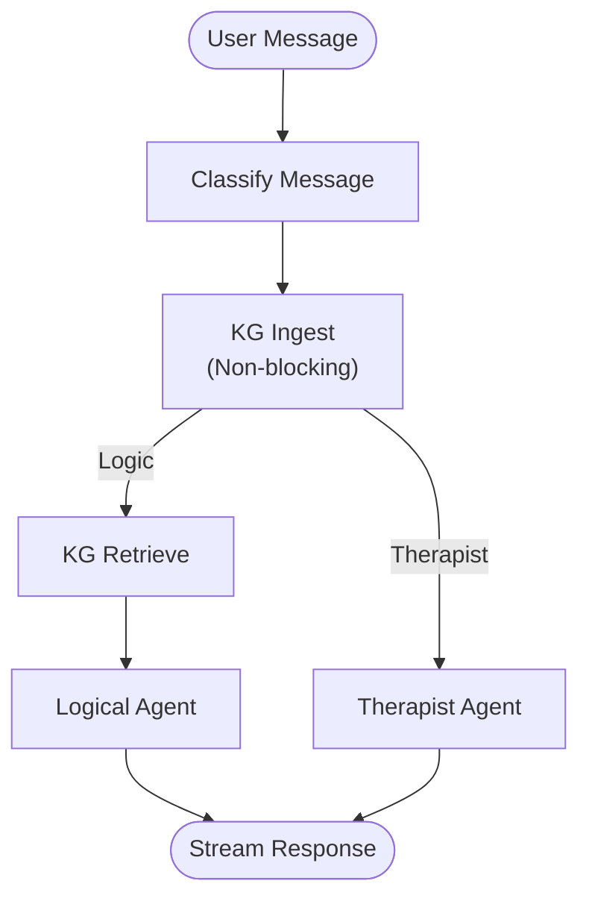
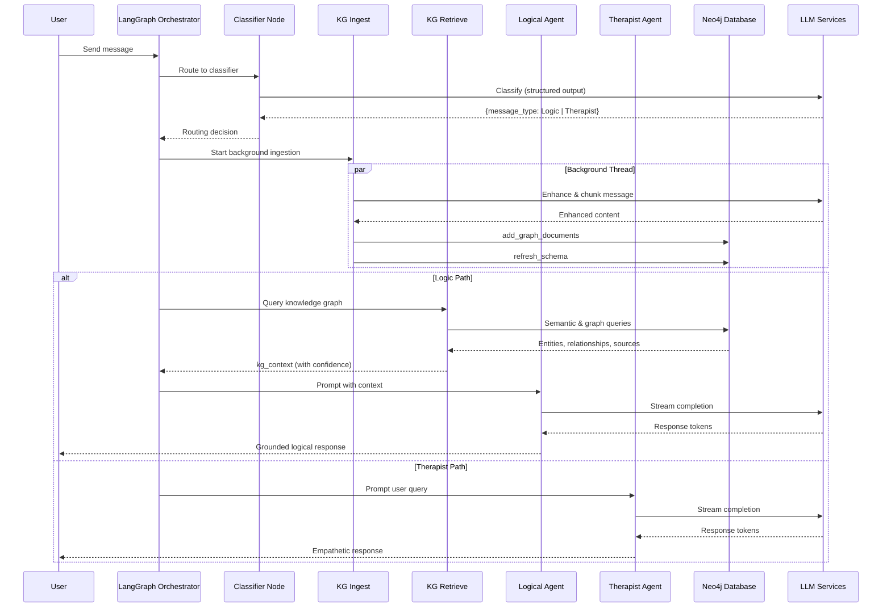

# Gen-AI-Exc: Emotion-Aware Assistant with Live Knowledge Graph

An intelligent conversational AI that combines empathetic support with logically grounded answers through real-time knowledge graph enrichment and multi-agent orchestration. Built with LangGraph, Neo4j, and integrated LLM services, Gen-AI-Exc intelligently routes user queries to either empathetic or logical responses while maintaining a persistent, continuously-updated knowledge graph that improves answer grounding with every interaction.

## Why This Wins

**Dual-Intelligence Design**: Classifies every message as emotional or logical, routing to a specialized Therapist agent for empathetic support or a Logical agent for grounded reasoning.

**Live Knowledge Graph**: Every user message asynchronously enriches a Neo4j knowledge graph, enabling real-time retrieval-augmented generation that provides sources, confidence scores, and factual grounding.

**Production-Ready Architecture**: Non-blocking KG ingestion, automatic schema refresh, credential isolation, and extensible integration points built from the ground up.

**Multi-Provider Integration**: Seamlessly combines Google Gemini for generation, Groq for fast structured extraction, and Neo4j for semantic graph reasoning—with planned support for Notion, MCP tools, and more.

---

## Quick Start Demo

### 1. Prerequisites

- Python 3.11+ (tested with Python 3.13)
- Neo4j instance (local or Aura) with connection credentials
- API keys: Google Gemini and Groq

### 2. Environment Setup

Create a `.env` file in the `backend/` directory:

```env
GOOGLE_API_KEY=your_gemini_key
groq_api_key=your_groq_key
neo4j_uri=bolt+s://your-host:7687
neo4j_username=neo4j
neo4j_password=your_password
neo4j_database=neo4j
```

### 3. Install & Run

```bash
cd backend
python -m venv venv

# On Windows PowerShell
venv\Scripts\Activate.ps1

# On macOS/Linux
source venv/bin/activate

pip install -r requirements.txt
python main.py
```

Try this prompt to see the system in action:

```
How do I plan my study schedule for exams?
```

The system will classify your message, ingest it into the knowledge graph asynchronously, retrieve relevant context, and return a grounded logical response with sources.

---

## Architecture & Design

### System Overview

Gen-AI-Exc orchestrates five core components through a state machine that processes each user message in a deterministic, observable flow:

1. **Classifier Node**: Analyzes the message and returns `Logic` or `Therapist` routing decision
2. **KG Ingest Node**: Asynchronously enhances, chunks, and writes the message to Neo4j
3. **KG Retrieve Node**: Queries the graph semantically and structurally to build contextual grounding
4. **Logical Agent**: Generates structured, fact-grounded responses using KG context
5. **Therapist Agent**: Produces warm, empathetic responses for emotional content

### Message Flow Diagram



### Detailed Sequence Diagram



### Core Module Reference

**`backend/graph/agent.py`**  
Builds the LangGraph state machine, defines nodes and edges, and orchestrates the routing logic.

**`backend/graph/nodes/classify_message.py`**  
Uses LLM structured output to return a `MessageType` enum (Logic or Therapist) based on message content.

**`backend/graph/nodes/kg_ingest.py`**  
Enhances and chunks user messages, converts them to graph documents, writes to Neo4j, and refreshes the schema in a background thread to avoid blocking the main response.

**`backend/graph/nodes/kg_retrieve.py`**  
Performs semantic and graph-structured queries against Neo4j, builds a `kg_context` object with confidence scores and source attribution, and formats it for the logical agent.

**`backend/graph/nodes/logical_agent.py`**  
Streams a grounded, structured response using the retrieved KG context to improve factual accuracy and explainability.

**`backend/graph/nodes/therapist_agent.py`**  
Streams a warm, empathetic response tailored to emotional or support-seeking queries, without relying on external context.

**`backend/KG/kg_builder.py`**  
The `RobustKnowledgeGraphBuilder` class handles message enhancement, semantic chunking, graph document creation, and writes to Neo4j with error resilience.

**`backend/KG/kg_query.py`**  
The `RobustKnowledgeGraphQuery` class executes hybrid semantic and structural queries, scores results by confidence, and formats output for agent consumption.

**`backend/models/llm.py`**  
Centralizes LLM client initialization (Gemini for generation, Groq for extraction) and manages API credentials.

**`backend/config/settings.py`**  
Pydantic-based configuration management that loads environment variables and provides typed access to all system settings.

---

## Technology Stack

| Component | Purpose | Library/Service |
|-----------|---------|-----------------|
| **Orchestration** | Multi-agent workflow | LangGraph, LangChain Core |
| **Text Generation** | Main inference (logical, empathetic) | Google Gemini |
| **Structured Extraction** | Graph building & retrieval | Groq (fast inference) |
| **Graph Database** | Persistent knowledge & reasoning | Neo4j 5.x |
| **Document Processing** | PDF, DOCX, unstructured text | unstructured, PyPDF2, python-docx |
| **Configuration** | Environment & settings management | Pydantic, python-dotenv |
| **Optional Integrations** | Protocol for tool extensions | MCP, Notion client |
| **Runtime** | Python execution | Python 3.11+ |

---

## Configuration

All configuration is managed through environment variables and the centralized `backend/config/settings.py`:

### Required Variables

- `GOOGLE_API_KEY`: Google Gemini API key for main LLM inference
- `groq_api_key`: Groq API key for fast extraction tasks
- `neo4j_uri`: Neo4j connection URI (e.g., `bolt+s://host:7687`)
- `neo4j_username`: Neo4j username
- `neo4j_password`: Neo4j password

### Optional Variables

- `neo4j_database`: Specific database to target (defaults to `neo4j`)
- `notion_api_key`: For Notion integration via MCP
- Additional logging and telemetry settings in `settings.py`

---

## Security & Privacy Considerations

**Credential Management**: All secrets are stored as environment variables and never committed to version control. The application loads credentials at startup via `get_credentials_from_env()`.

**User Data Handling**: User messages are logged minimally and only as needed for debugging. Consider implementing data retention policies and redaction rules for sensitive content in production deployments.

**Wellness Safeguards**: For use cases involving emotional support or mental health, the system should include guardrails for crisis language detection and escalation guidance. This is particularly important if deployed as a therapy-adjacent tool.

**Neo4j Security**: Use strong passwords, rotate credentials regularly, and enable encryption in transit with Neo4j Aura or equivalent.

---

## Cost Estimates

For a representative hackathon-scale deployment processing approximately 5,000 messages per month with an average of 500 tokens per message:

| Service | Monthly Volume | Estimated Cost |
|---------|---|---|
| LLM Inference (Gemini 2.5 Flash) | 5M input + 5M output tokens | $15–$60 |
| Structured Extraction (Groq) | 5K short prompts | $5–$25 |
| Neo4j AuraDB | Free or entry tier | $0–$65 |
| Hosting (small VM or serverless) | Single instance | $5–$20 |
| Logs, monitoring, storage | — | $0–$10 |
| **Total Range** | — | **$25–$180/month** |

**Cost Optimization Tips**: Disable KG ingestion for low-value or short messages; batch extraction jobs during off-peak hours; use Neo4j's free tier for development and early-stage production.

---

## Extensibility & Roadmap

The architecture supports seamless extension through modular node design and clear integration points:

- **Web UI**: Add a React/Next.js frontend with chat history, session management, and a collapsible KG context panel
- **Notion Sync**: Extend KG ingest to bidirectionally sync journaling and task data via MCP protocol
- **Speech I/O**: Integrate STT/TTS services for accessibility and voice-first interaction
- **Domain Ontologies**: Build fine-grained Neo4j schemas for specialized use-cases (wellness, education, professional development)
- **Multi-Language Support**: Add language detection and multilingual routing to Therapist/Logical agents
- **Confidence-Based Filtering**: Dynamically adjust response generation based on retrieval confidence thresholds

---

## 90-Second Pitch

**Problem**: Current AI assistants oscillate between unhelpful empathy and cold logic, and lack persistent, structured memory of user context.

**Solution**: Gen-AI-Exc combines emotion-aware message routing with a live knowledge graph that grows and improves with every turn, providing grounded, contextual, and empathetic responses.

**Demo**: A user asks a planning question → the system classifies it as logic → asynchronously enriches the KG → retrieves relevant context with confidence scores → streams a grounded response with sources → or alternatively, routes emotional queries to an empathetic agent.

**Proof**: Real Neo4j writes, retrieval confidence scoring, visible source attribution, and streaming responses demonstrate a working, production-minded system.

**Impact**: Builds user trust through transparency, improves clarity with logical grounding, and enables extensibility to productivity tools (Notion), wellness use-cases, and specialized domains.

---

## Repository Structure

```
backend/
├── main.py                          # CLI entry point
├── requirements.txt                 # Python dependencies
├── .env                             # Environment variables (not committed)
├── config/
│   └── settings.py                  # Pydantic configuration management
├── graph/
│   ├── agent.py                     # LangGraph orchestration
│   └── nodes/
│       ├── classify_message.py      # Message type classifier
│       ├── kg_ingest.py             # Graph ingestion (async)
│       ├── kg_retrieve.py           # Graph query & retrieval
│       ├── logical_agent.py         # Structured logical responses
│       └── therapist_agent.py       # Empathetic responses
├── KG/
│   ├── kg_builder.py                # RobustKnowledgeGraphBuilder class
│   └── kg_query.py                  # RobustKnowledgeGraphQuery class
└── models/
    └── llm.py                       # LLM client initialization
```

---

## Debugging & Development

To inspect the state machine flow, enable verbose logging:

```python
import logging
logging.basicConfig(level=logging.DEBUG)
```

To inspect Neo4j queries and results, query the database directly:

```cypher
MATCH (n) RETURN COUNT(n) as total_nodes LIMIT 10
MATCH (n)-[r]-(m) RETURN n, r, m LIMIT 5
```

To test the classifier independently:

```bash
python -c "from backend.graph.nodes.classify_message import classify_message; print(classify_message('I feel sad'))"
```

---

## Contributing

Contributions are welcome! Please follow these guidelines:

1. Fork the repository
2. Create a feature branch (`git checkout -b feature/your-feature`)
3. Commit with clear messages
4. Submit a pull request with a description of changes and motivation

For significant architectural changes, please open an issue first to discuss the approach.

---

## License

MIT License. See LICENSE file for details.

---

## Support & Questions

For issues, questions, or feature requests, please open a GitHub issue. For security vulnerabilities, please email privately rather than opening a public issue.

---

## Acknowledgments

Built with LangGraph, Neo4j, Google Gemini, and Groq. Special thanks to the LangChain community for foundational tooling and best practices.
