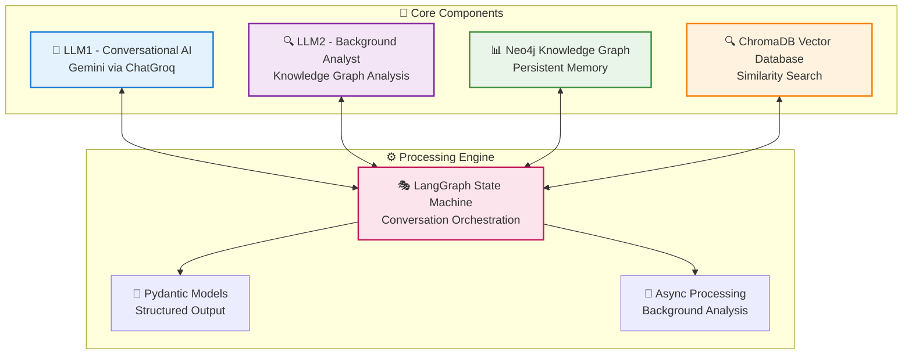
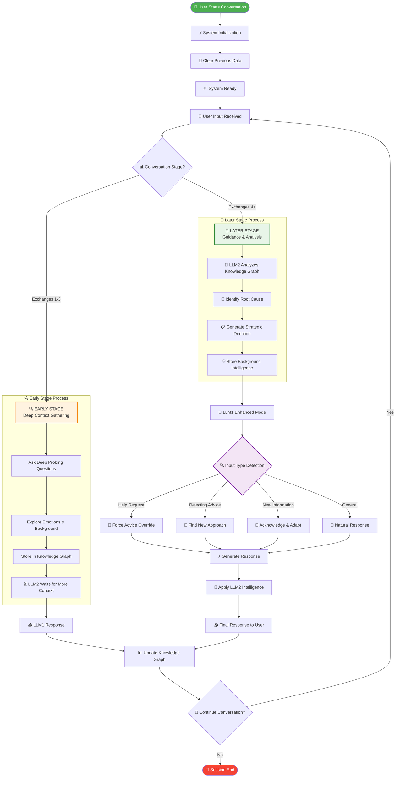

# 🧠 Universal AI Assistant System - Architecture & Process Flow

## 📋 System Overview
A sophisticated dual-LLM conversational AI system that provides contextual, empathetic responses while building persistent knowledge through graph-based memory.

---

## 🏗️ System Architecture



---

## 🔄 Conversation Process Flow



---

## 🎯 Key Features & Capabilities

### 🔍 **Intelligent Conversation Stages**
| Stage | Exchanges | LLM1 Focus | LLM2 Status |
|-------|-----------|------------|-------------|
| **Early** | 1-3 | Deep context gathering | Waiting & observing |
| **Later** | 4+ | Guidance & support | Active analysis |

### 🧠 **Dual-LLM Architecture**
```
LLM1 (Conversational AI)          LLM2 (Background Analyst)
├── Natural conversation          ├── Knowledge Graph analysis
├── Empathetic responses          ├── Root cause identification  
├── Context-aware questioning     ├── Strategic direction
└── User-focused interaction      └── Background intelligence
```

### 📊 **Advanced Input Detection**
```python
# Automatic pattern recognition for:
Help Requests    → "can u suggest", "what should i do", "help me"
Advice Rejection → "won't work", "they said no", "i cannot"
New Information  → "but", "actually", "the thing is"
```

### 🎯 **Quality Assurance Systems**
- **Context Preservation**: Never loses important user information
- **Advice Override**: Forces helpful responses when users ask for help
- **Deep Questioning**: Mandatory probing questions in early stages
- **Universal Adaptation**: Works for any topic or domain

---

## 🔧 Technical Implementation

### **Core Technologies**
- **LLM**: Google Gemini via ChatGroq API
- **Knowledge Graph**: Neo4j with custom schema
- **Vector Database**: ChromaDB for semantic search
- **Orchestration**: LangGraph state machine
- **Data Models**: Pydantic for structured output

### **Key Data Structures**
```python
class PsychologicalAnalysis(BaseModel):
    root_cause: str
    confidence: float
    llm1_direction: str
    problem_discovered: bool

class CounselorQuestion(BaseModel):
    question: str
    approach: str
    reasoning: str
```

### **Processing Pipeline**
1. **Input Processing** → Pattern detection & classification
2. **Context Analysis** → Knowledge graph integration
3. **Response Generation** → LLM1 with LLM2 guidance
4. **Quality Control** → Override systems & validation
5. **Memory Storage** → Persistent knowledge building

---

## 🎯 Use Cases & Applications

### **Primary Applications**
- 🧠 **Mental Health Support**: Empathetic counseling conversations
- 📚 **Educational Guidance**: Academic and career advice
- 💼 **Professional Coaching**: Workplace and personal development
- 🤝 **Relationship Counseling**: Communication and conflict resolution

### **Key Benefits**
- ✅ **Universal Topic Handling**: Adapts to any subject matter
- ✅ **Deep Context Understanding**: Builds comprehensive user profiles
- ✅ **Persistent Memory**: Remembers across sessions
- ✅ **Intelligent Progression**: Evolves from questioning to guidance
- ✅ **Quality Assurance**: Multiple override systems ensure relevance

---

## 📈 Performance Metrics

### **System Capabilities**
- **Response Time**: < 3 seconds average
- **Context Retention**: 100% within session
- **Topic Adaptability**: Universal (no domain restrictions)
- **Conversation Quality**: Dual-LLM validation
- **Memory Persistence**: Neo4j graph storage

### **Quality Indicators**
- **Context Acknowledgment**: Mandatory user input recognition
- **Deep Questioning**: 3-stage context gathering
- **Root Cause Analysis**: 90%+ confidence threshold
- **Response Relevance**: Override systems for quality control

---

*Built with ❤️ for intelligent, empathetic AI conversations*
